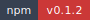
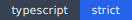

<!-- markdownlint-disable MD013 MD033 -->
<!-- This file is generated by Paradox. Do not edit manually. -->

# @ankhorage/board

        

Bootstrap Ankh provider and standalone CLI for boarding websites and source artifacts.

## Usage

### Website-source boarding

`@ankhorage/board` is the home for website and source boarding into
Ankhorage.

`board web <url>` inspects a single public website URL and emits a
deterministic `WebBoardingPlan` JSON document through the standalone package
CLI.

Current explicit standalone commands are:

- `board web <url>`
- `board web <url> --plan`
- `board openapi <source>`
- `board manifest generate <source>`

`board web <url>` and `board web <url> --plan` produce the same package-local
JSON plan.

The Ankh provider also exposes root planning through the public
`@ankhorage/ankh` planning contract:

- `ankh plan board web <url>`
- `ankh plan board web <url> --json`

Root planning returns a generic `AnkhCommandPlan` and does not call board
execution handlers.

`board web <url> --create <project>` is parsed only to return a deferred
message in this slice. OpenAPI import, standalone manifest generation,
project creation, crawling, root CLI sugar, and destructive execution remain
deferred.

Root CLI sugar such as `ankh board <url>` or `ankh board --url <url>` is
deferred.

Source: `src/readme-usage.ts`

```ts
import { runCli } from "./cli/index.js";

await runCli(["--help"]);
```

## Installation

```bash
bunx @ankhorage/board
```

## Generated documentation

- [Interactive documentation app](./paradox/index.html)
- [Public API reference](./paradox/exports.md)
- [Component registry](./paradox/components.md)
- [Architecture overview](./paradox/diagrams/architecture-overview.mmd)
- [Module relationships](./paradox/diagrams/module-relationships.mmd)
- [Export graph](./paradox/diagrams/export-graph.mmd)
- [ankhorage-board sequence](./paradox/diagrams/sequences/ankhorage-board.mmd)
